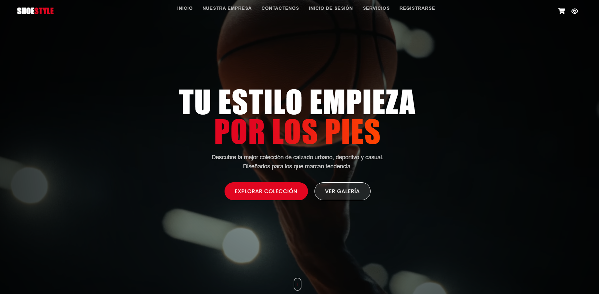
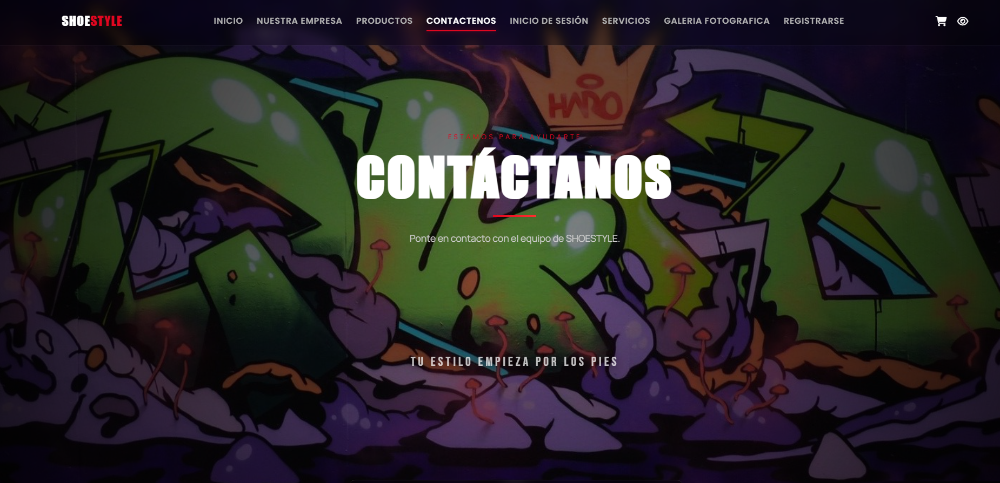
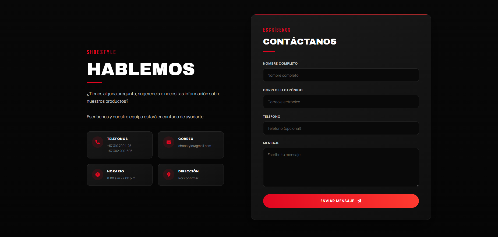
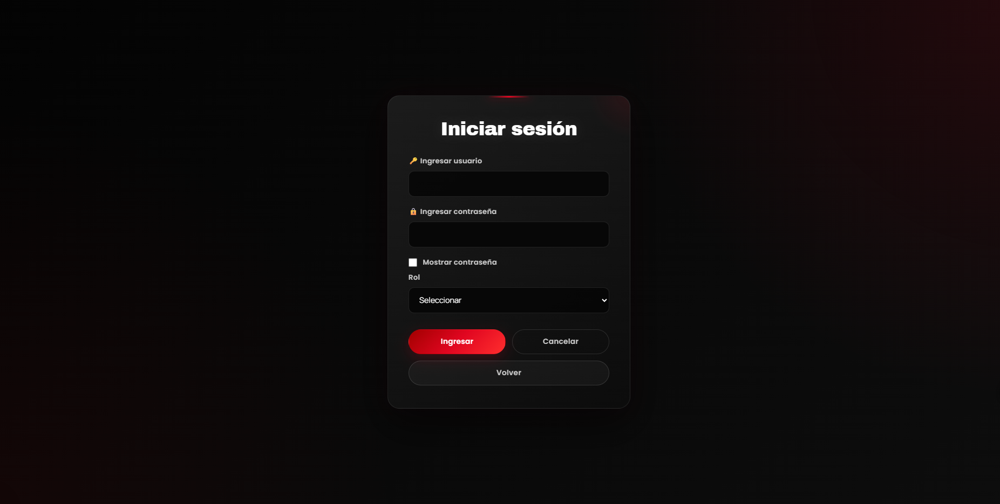

# 👟 SHOESTYLE

<p align="center">
  <strong>Plataforma web para una tienda de calzado</strong>
</p>

<p align="center">
  Una solución web completa para la gestión y presentación de una tienda de calzado.
</p>

<p align="center">

[](https://shoestyle-2.onrender.com/paginas/galeria%20fotografica.html)
[](https://www.php.net/)
[](https://aiven.io/)
[](https://www.docker.com/)
[](https://render.com/)

</p>

<p align="center">
  <a href="https://shoestyle-2.onrender.com/index.php">
    🚀 Ver aplicación
  </a>
  •
  <a href="https://github.com/Danek18328/Shoestyle">
    Código fuente
  </a>
</p>

---

## 📖 Sobre el proyecto

**SHOESTYLE** es una plataforma web desarrollada para presentar, administrar y gestionar una tienda de calzado mediante una interfaz moderna, responsive y funcional.

El proyecto integra catálogo de productos, usuarios, compras, carrito, facturación, administración, contacto, reseñas, sistema de visitas y generación de reportes.

La aplicación utiliza **PHP y MySQL** en el backend y está desplegada mediante **Docker y Render**, con la base de datos alojada en **Aiven**.

---

# 📸 Showcase

<p align="center">
  
</p>

<p align="center">
  
  
  
</p>

---

# ✨ Características

### 🏠 Experiencia de usuario

- Diseño responsive
- Página principal
- Navegación entre secciones
- Galería fotográfica
- Presentación de la empresa
- Servicios
- Redes sociales
- Formulario de contacto
- Contenido multimedia

### 👟 Productos

- Catálogo dinámico
- Consulta de productos desde MySQL
- Información detallada
- Gestión de inventario
- Creación de productos
- Edición de productos
- Eliminación de productos

### 👤 Usuarios

- Registro
- Inicio de sesión
- Sistema de roles
- Acceso diferenciado
- Gestión de clientes

### 🛒 Compras

- Selección de productos
- Carrito mediante sesiones PHP
- Cálculo automático del total
- Registro de compras
- Registro de ventas
- Generación de facturas
- Impresión de facturas

### 🧾 Facturación y reportes

- Facturas
- Reportes de productos
- Reportes de ventas
- Reportes de empleados
- Exportación a PDF mediante FPDF

### ⭐ Reseñas

Los usuarios pueden dejar valoraciones incluyendo:

- Nombre
- Comentario
- Calificación
- Registro en MySQL

### 📩 Contacto

El formulario permite registrar:

- Nombre completo
- Correo electrónico
- Teléfono
- Mensaje

### 📊 Administración

El panel administrativo permite:

- Gestionar productos
- Gestionar empleados
- Consultar ventas
- Gestionar inventario
- Actualizar registros
- Eliminar registros
- Consultar estadísticas
- Exportar información

### 👁️ Sistema de visitas

Sistema de conteo de visitas conectado a MySQL para registrar y consultar los accesos recibidos por la plataforma.

---

# 🛠️ Tecnologías utilizadas

## 🎨 Frontend

<p align="center">


</p>

## ⚙️ Backend

<p align="center">


</p>

## 🗄️ Base de datos

<p align="center">


</p>

## 🐳 Infraestructura

<p align="center">


</p>

## 📚 Librerías y extensiones

<p align="center">


</p>

---

# 🐳 Docker

SHOESTYLE utiliza Docker para proporcionar un entorno de ejecución consistente.

La aplicación utiliza:

```text
PHP 8.2
Apache
MySQLi
